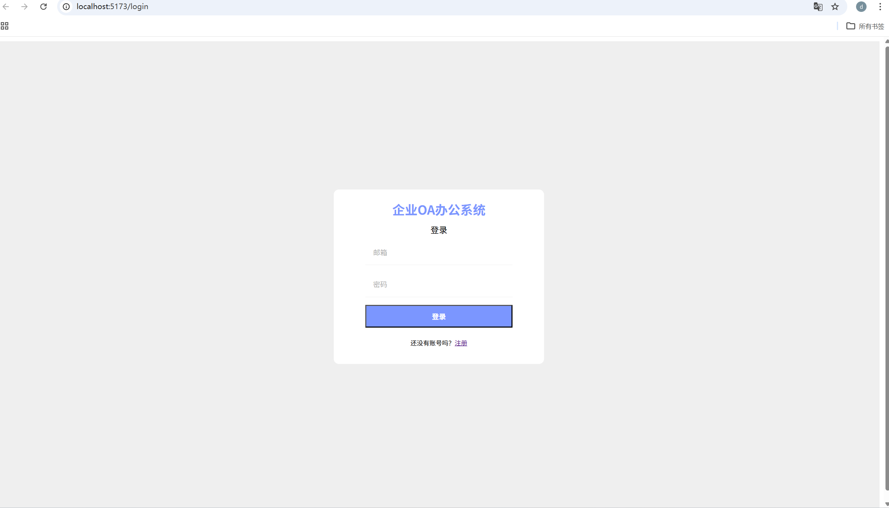
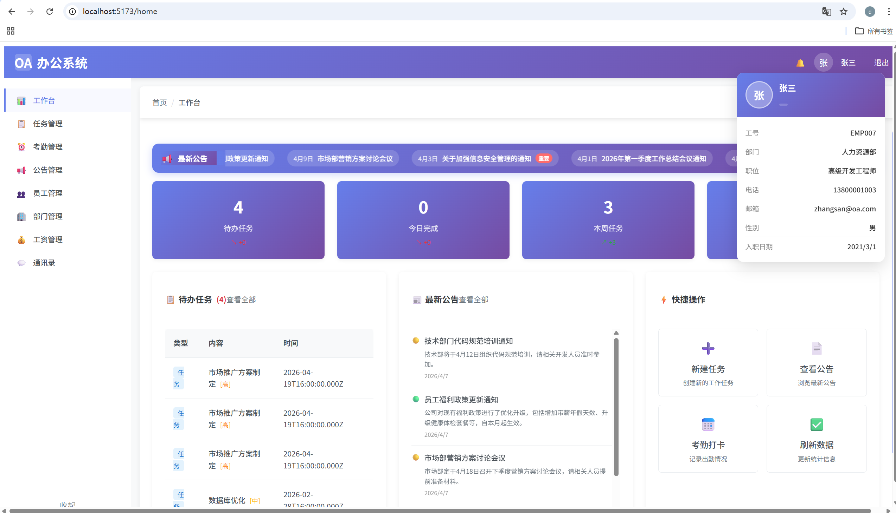

# 企业OA办公系统

前后端分离的企业OA办公系统，支持用户管理、考勤打卡、请假审批、任务分配、即时通讯等功能。

## 项目地址

- **前端仓库**: https://github.com/88Codecat/oa-front-end.git
- **后端仓库**: https://github.com/88Codecat/oa-system.git

## 技术栈

### 前端
React 19 + React Router 7 + Vite + Sass + Axios + Socket.io-client

### 后端
Node.js + Express + MySQL + JWT + Socket.io

## 功能特性

- ✅ 用户认证与权限管理（RBAC三角色体系）
- ✅ 组织架构管理（部门、职位、员工）
- ✅ 考勤打卡与统计
- ✅ 请假申请与审批（自动联动考勤）
- ✅ 任务分配与进度跟踪
- ✅ 公告通知发布
- ✅ 薪资管理
- ✅ 即时通讯（WebSocket实时消息）

## 系统截图


*图1：系统登录页面*


*图2：工作台首页*

---

## 快速开始

### 1. 克隆项目

```bash
# 克隆后端
git clone https://github.com/88Codecat/oa-system.git
cd oa-system

# 克隆前端
git clone https://github.com/88Codecat/oa-front-end.git
cd oa-front-end
```

### 2. 后端部署

详细步骤请查看 [oa-system/README.md](https://github.com/88Codecat/oa-system/blob/main/README.md)

```bash
cd oa-system
npm install

# 配置数据库
# 创建 MySQL 数据库 oa_system，导入 init.sql

# 创建 .env 文件
PORT=3000
DB_HOST=localhost
DB_PORT=3306
DB_USER=root
DB_PASSWORD=your_password
DB_NAME=oa_system
JWT_SECRET=your_jwt_secret_key_here
JWT_EXPIRES_IN=7d

npm run dev
```

### 3. 前端部署

```bash
cd oa-front-end
npm install

# 配置 API 地址（默认 http://localhost:3000）
# 编辑 src/utils/api.js 修改 API_BASE_URL

npm run dev
```

### 4. 访问系统

- 前端地址: http://localhost:5173
- 后端地址: http://localhost:3000

## 默认管理员账号

| 角色 | 用户名 | 密码 |
|------|--------|------|
| 管理员 | admin | admin123 |

> ⚠️ 首次登录后请立即修改密码！

---

## 项目结构

```
A-OA/
├── oa-system/           # 后端项目
│   ├── config/         # 数据库配置
│   ├── middleware/     # 中间件
│   ├── models/         # 数据模型
│   ├── routes/         # API路由
│   ├── app.js          # 应用入口
│   └── init.sql        # 数据库初始化
│
├── oa-front-end/       # 前端项目
│   ├── src/
│   │   ├── components/ # 公共组件
│   │   ├── pages/      # 页面组件
│   │   ├── router/     # 路由配置
│   │   └── utils/      # 工具函数
│   └── package.json
│
└── README.md           # 项目总览
```

---

## 前端开发指南

### 环境要求

- Node.js 18.x 或更高版本
- npm 或 yarn 包管理器

### 常用命令

```bash
npm run dev      # 启动开发服务器
npm run build    # 构建生产版本
npm run lint     # 代码检查
npm run preview  # 预览生产构建
```

## 技术栈（前端）

- **框架**: React 19.2
- **路由**: React Router 7
- **构建工具**: Vite 7.2
- **HTTP客户端**: Axios
- **样式**: Sass
- **实时通信**: Socket.io-client

## 环境要求

- Node.js 18.x 或更高版本
- npm 或 yarn 包管理器

## 安装步骤

### 1. 克隆前端项目

```bash
git clone https://github.com/88Codecat/oa-front-end.git
cd oa-front-end
```

### 2. 安装依赖

```bash
npm install
```

### 3. 配置 API 地址（可选）

前端默认连接 `http://localhost:3000`。如需修改，编辑 `src/utils/api.js` 文件：

```javascript
const API_BASE_URL = 'http://your-server:3000';
```

### 4. 启动开发服务器

```bash
npm run dev
```

前端启动后，运行在 `http://localhost:5173`。

### 5. 构建生产版本

```bash
npm run build
```

构建产物将输出到 `dist` 目录。

## 功能模块

| 模块 | 说明 |
|------|------|
| 首页 | 工作台、快捷入口 |
| 用户管理 | 员工档案管理 |
| 组织架构 | 部门、职位管理 |
| 考勤管理 | 打卡签到、考勤统计 |
| 请假审批 | 请假申请、审批流程 |
| 任务管理 | 任务分配、进度跟踪 |
| 公告通知 | 公司公告发布 |
| 薪资管理 | 工资单查看 |
| 即时通讯 | 实时聊天、消息通知 |
| 个人中心 | 个人信息、密码修改 |

## 项目结构

```
oa-front-end/
├── src/
│   ├── components/      # 公共组件
│   │   ├── Layout.jsx   # 布局组件
│   │   ├── Navbar.jsx   # 导航栏
│   │   └── Sidebar.jsx  # 侧边栏
│   ├── pages/           # 页面组件
│   │   ├── Home/        # 首页
│   │   ├── User/        # 用户管理
│   │   ├── Department/  # 部门管理
│   │   ├── Attendance/  # 考勤管理
│   │   ├── Leave/       # 请假管理
│   │   ├── Task/        # 任务管理
│   │   ├── Announcement/ # 公告管理
│   │   ├── Salary/      # 薪资管理
│   │   ├── Message/     # 即时通讯
│   │   └── Login/       # 登录页
│   ├── router/          # 路由配置
│   │   └── index.jsx
│   ├── utils/           # 工具函数
│   │   ├── api.js       # API请求封装
│   │   ├── auth.js      # 认证工具
│   │   └── socket.js    # Socket.io客户端
│   ├── App.jsx          # 根组件
│   ├── main.jsx         # 入口文件
│   └── main.scss       # 全局样式
├── public/              # 静态资源
├── package.json
├── vite.config.js       # Vite配置
└── .eslintrc.js         # ESLint配置
```

## 角色权限

| 角色 | 权限范围 |
|------|----------|
| 管理员 (admin) | 全系统所有功能 |
| 经理 (manager) | 本部门员工管理、任务分配、审批 |
| 员工 (employee) | 个人考勤、请假、任务、聊天 |

## 浏览器兼容性

- Chrome 90+
- Firefox 90+
- Safari 14+
- Edge 90+

## 常见问题

### 1. 端口被占用

如果 5173 端口被占用，Vite 会自动切换到其他端口，终端会显示实际访问地址。

### 2. API 请求失败

确保后端服务已启动并正常运行，前端配置的 API 地址与后端地址一致。

### 3. 样式异常

请确保已安装 Sass 依赖：
```bash
npm install sass
```

## 许可证

MIT License
